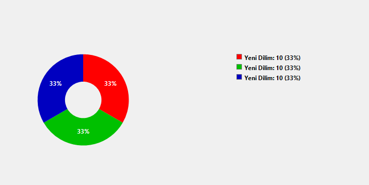

# CSharpDonutSliceWinForms
A customizable and visually enhanced **Donut Chart (Pie Chart with center hole)** control for Windows Forms (.NET).  
Ideal for modern UI dashboards or statistical visualizations where a clean circular chart with percentage labels is needed.

---

## 📌 Features

- 🎨 Each slice has its own color, label, and value
- 📐 Configurable inner radius (`DonutThicknessRatio`)
- 🔲 Transparent background support for seamless integration
- 📊 Auto-calculated percentages for each slice
- 🖼️ Optional legend on the right showing labels + values
- 🔁 Design-time editable via property grid (`List<DonutSlice>`)

---


## DonutChart.cs



A custom UserControl that draws the donut chart with all visual elements and properties like:

* Data: List<DonutSlice>

* DonutThicknessRatio

* OverlayControl (for transparency effect to show background.)


# 🚀 How to Use


### Step 1: Add to your Form 

---

```
DonutChart donutChart1 = new DonutChart();
this.Controls.Add(donutChart1);
```


Alternatively, use the toolbox to drag the control onto your form.

---

### Step 2: Add Data

---

```
donutChart1.Data.Add(new DonutSlice { Label = "Red", Value = 40f, Color = Color.Red });
donutChart1.Data.Add(new DonutSlice { Label = "Blue", Value = 30f, Color = Color.Blue });
donutChart1.Data.Add(new DonutSlice { Label = "Green", Value = 30f, Color = Color.Green }); 
```

🔧 Alternatively, donut slices can be added and edited at **design time** via the **Properties panel** in Visual Studio, using the built-in collection editor for the `Data` property.


---

### Step 3: Customize Appearance (Optional)

---

```
donutChart1.DonutThicknessRatio = 0.35f;
donutChart1.BackColor = Color.Transparent;
donutChart1.Dock = DockStyle.Fill;
```

---

# ADVANCED

### Transparent Background Handling:
Uses OverlayControl or Parent to draw background under the donut.

### Legend Rendering:
Automatically placed to the right of the chart with label + value + percentage.

### Auto Percentage Calculation:
Each slice's percentage is dynamically calculated based on total value.

# 🛠️ Installation

Either create a class from visual studio and paste the code into your own created class or clone the repository by

```
git clone https://github.com/Informal061/CSharpDonutSliceWinForms.git 
```

And open the solution or copy DonutChart.cs into your WinForms project.


# 📄 License

This project is licensed under the MIT License.


# 🙋‍♂️ Author
Developed by Informal061
Feel free to fork, use, and contribute!

